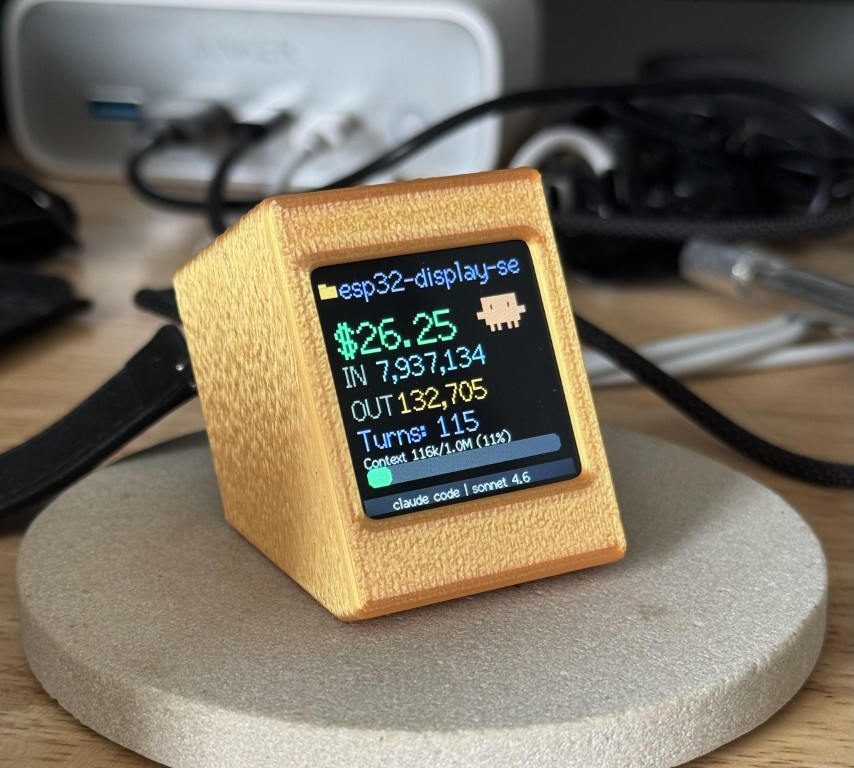

# ESP32 Display Server for Claude Code

A physical ambient display that shows real-time Claude Code session stats on a 240x240 TFT screen, powered by an ESP32-S3. Features animated token counters, cost tracking, context window usage, and a bouncy pixel-art Claude mascot.



## What it does

After every Claude Code response, the display updates with:
- **Estimated API cost** (animated count-up, correct per-model pricing)
- **Billed-equivalent input/output token counts** (animated)
- **Turn counter**
- **Context window usage** (progress bar, color-coded green/yellow/red)
- **Project folder name** in the header (scrolls if too long, or truncates — configurable)
- **Current model** in the footer (updates dynamically as you switch models)
- **Pixel-art Claude mascot** that does a double-bounce squish animation
- **Multi-session aware** — updates for whichever session last responded

### Screensavers

Two screensaver modes trigger after a configurable idle timeout (default 5 minutes):

- **Nyan** — Claude bounces around the screen DVD-logo style with a fixed-length rainbow ghost trail, parallax starfield, and random UFO flybys
- **Drift** — Claude tumbles through space with continuous rotation and depth scaling (bounces toward/away from you in a 3D illusion)

Screensaver mode, idle timeout, and all display preferences are configurable via the web UI at `http://esp32-display.local/settings`.

## Hardware

- **ESP32-S3 Super Mini** (with 2MB PSRAM)
- **1.54" ST7789 240x240 TFT display**
- **3D printed case** from [BambuHelper by Keralots](https://github.com/Keralots/BambuHelper) (designed for a Bambu Lab printer monitor, works great as a general-purpose ESP32 display enclosure)

### Wiring

| Display Pin | ESP32-S3 Pin |
|-------------|-------------|
| MOSI (SDA)  | GPIO 11     |
| SCLK (SCL)  | GPIO 12     |
| CS          | GPIO 10     |
| DC          | GPIO 9      |
| RST         | GPIO 8      |
| BL          | GPIO 13     |
| VCC         | 3.3V        |
| GND         | GND         |

## Architecture

```
Claude Code
    |
    |-- Stop Hook (update_display.py)
    |       Fires after each response, reads transcript,
    |       calculates stats, sends single POST to /dashboard
    |
    |-- MCP Server (mcp_server.py)
    |       Exposes drawing tools so Claude can draw on the display
    |       pause_display / resume_display to hold drawings between hook fires
    |
    v
ESP32-S3 Firmware (main.cpp)
    |-- HTTP server on port 80
    |-- /dashboard endpoint: receives stats, runs animation onboard
    |-- /settings web UI: screensaver, header, WiFi config
    |-- Drawing primitives: text, rect, circle, line, bar, gauge
    |-- /batch endpoint with PSRAM framebuffer (flicker-free)
    |-- /update endpoint for OTA firmware updates
    |-- AP mode WiFi provisioning (no hardcoded credentials)
    |-- mDNS: esp32-display.local
    |
    v
ST7789 240x240 TFT Display
```

## Quick Start (pre-built firmware)

No toolchain needed. Grab the latest merged binary from the `releases/` folder and flash with the [Espressif web flasher](https://espressif.github.io/esptool-js/):

1. Connect ESP32-S3 via USB
2. Open [https://espressif.github.io/esptool-js/](https://espressif.github.io/esptool-js/)
3. **Erase flash** first
4. Flash `releases/firmware-5.1-nyan-merged.bin` at address `0x0`
5. Unplug USB (important — usbipd can prevent boot on WSL2)
6. Power on — the display will show WiFi setup instructions

### WiFi Setup (AP Mode)

On first boot the ESP32 starts a setup hotspot:

1. Connect your phone or laptop to **`ESP32-Display-Setup`**
2. Open a browser and go to **`192.168.4.1`**
3. Enter your WiFi SSID and password, hit Save
4. The device reboots and connects — the IP and `esp32-display.local` are shown on the display

WiFi credentials are stored in NVS (non-volatile storage) and survive firmware updates.

---

## Setup (hooks + MCP)

### 1. MCP Server

Requires Python 3 with `requests` and `mcp` packages:

```bash
pip install requests mcp
```

Add to your Claude Code MCP config (`~/.claude/.mcp.json` for global, or `.mcp.json` in project root):

```json
{
  "mcpServers": {
    "esp32-display": {
      "type": "stdio",
      "command": "python3",
      "args": ["/path/to/esp32-display-server/mcp_server.py"]
    }
  }
}
```

### 2. Dashboard Hook

Add the Stop hook to Claude Code settings (`~/.claude/settings.json` for global, or `.claude/settings.local.json` per project):

```json
{
  "hooks": {
    "Stop": [
      {
        "hooks": [
          {
            "type": "command",
            "command": "python3 /path/to/esp32-display-server/update_display.py",
            "timeout": 10,
            "async": true
          }
        ]
      }
    ]
  }
}
```

### 3. IP / mDNS

By default `update_display.py` tries `esp32-display.local` first and falls back to the hardcoded IP. Update `ESP32_IP` in `update_display.py` and `mcp_server.py` if your network doesn't support mDNS.

---

## Settings

Visit `http://esp32-display.local/settings` in any browser to configure:

| Setting | Options |
|---------|---------|
| Screensaver mode | Nyan / Drift / Disabled |
| Idle timeout | Minutes (0 = never) |
| Long folder names | Scroll / Truncate |
| WiFi credentials | SSID + password |
| Clear WiFi | Wipe creds, reboot to AP mode |

All settings are saved to NVS and persist across reboots and OTA updates. Changes take effect immediately — no reboot needed (except WiFi credential changes).

---

## Building from Source

Install [PlatformIO](https://platformio.org/).

```bash
# config.h is gitignored — copy the example
cp include/config.example.h include/config.h
# No WiFi creds needed — provisioned via AP mode at runtime

# Build (versioned bin created automatically)
pio run --target clean && pio run

# Firmware bin: .pio/build/esp32s3/firmware-<version>.bin
```

### OTA Updates (after first flash)

Visit `http://esp32-display.local/update` in your browser and upload the firmware bin, or:

```bash
curl -F "firmware=@.pio/build/esp32s3/firmware-<version>.bin" http://esp32-display.local/update
```

---

## API Endpoints

| Endpoint | Method | Description |
|----------|--------|-------------|
| `/status` | GET | Device info (IP, RSSI, uptime, version) |
| `/help` | GET | API documentation |
| `/settings` | GET/POST | Web UI for all device settings |
| `/dashboard` | POST | Full session stats — ESP animates the display |
| `/batch` | POST | Multiple draw commands, framebuffered |
| `/clear` | POST | Fill screen with color |
| `/text` | POST | Draw text |
| `/rect` | POST | Draw rectangle |
| `/circle` | POST | Draw circle |
| `/line` | POST | Draw line |
| `/bar` | POST | Horizontal progress bar |
| `/gauge` | POST | Circular gauge |
| `/brightness` | POST | Set backlight (0-255) |
| `/screensaver` | POST | Trigger screensaver: `{"mode":"nyan"}` or `{"mode":"drift"}` |
| `/wifi` | POST | Update WiFi credentials: `{"ssid":"x","pass":"y"}` |
| `/wifi/clear` | POST | Wipe credentials, reboot into AP mode |
| `/update` | GET/POST | OTA firmware upload |

## Pricing

Token costs are calculated per-model from the transcript:

| Model | Input | Output | Cache Write | Cache Read |
|-------|-------|--------|-------------|------------|
| Claude Opus 4.6 | $5/M | $25/M | $6.25/M | $0.50/M |
| Claude Sonnet 4.6 | $3/M | $15/M | $3.75/M | $0.30/M |
| Claude Haiku 4.5 | $1/M | $5/M | $1.25/M | $0.10/M |

Mixed-model sessions are billed accurately per turn. The displayed IN token count is normalized to a billed-equivalent value so it correlates with the dollar amount shown.

## Drawing with Claude

Once the MCP server is configured, just ask Claude in natural language:

- *"Draw a red circle in the center of the screen"*
- *"Pause dashboard updates and draw a smiley face"*
- *"Resume dashboard updates"*
- *"What's the display status?"*

The MCP server exposes these tools:

| Tool | Description |
|------|-------------|
| `display_clear` | Fill screen with a color |
| `display_text` | Draw text at x,y |
| `display_rect` | Draw a rectangle |
| `display_circle` | Draw a circle |
| `display_line` | Draw a line |
| `display_bar` | Horizontal progress bar |
| `display_gauge` | Circular gauge |
| `display_batch` | Multiple commands, flicker-free |
| `display_brightness` | Set backlight level |
| `display_status` | Get device status |
| `pause_display` | Pause Stop hook updates so drawings persist |
| `resume_display` | Resume automatic dashboard updates |

`pause_display` / `resume_display` work by creating/deleting `/tmp/esp32_display_paused`. When paused, the Stop hook skips posting to `/dashboard` so your drawing stays on screen indefinitely.

## Customization

- **Display layout / pricing**: Edit `update_display.py` — no firmware flash needed
- **Draw anything**: Use the MCP tools from Claude, or POST directly to the HTTP API
- **Pin assignments**: Edit `include/config.h` and TFT_eSPI flags in `platformio.ini`
- **mDNS hostname**: Change `MDNS_HOSTNAME` in `include/config.h`

## License

MIT
